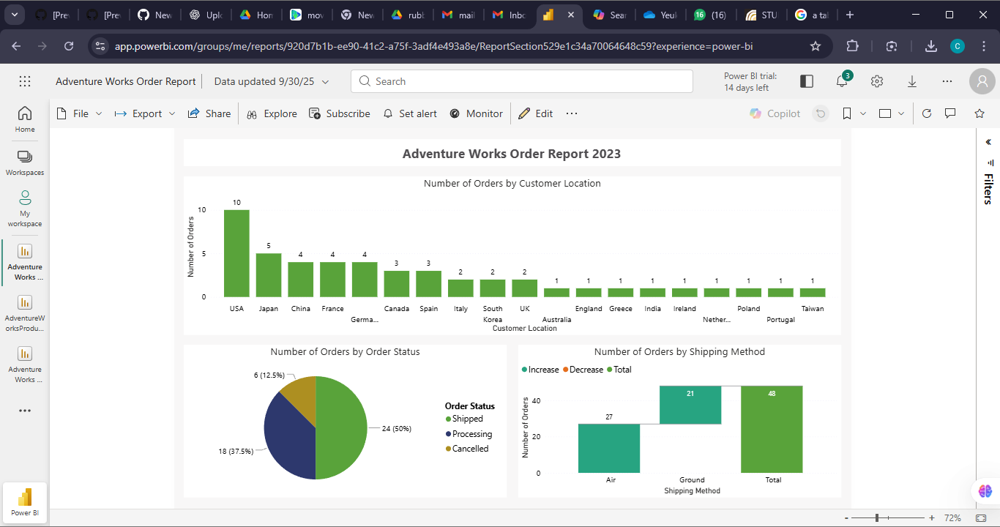

Adventure Works Order Report 2023

This project showcases a Power BI dashboard visualizing customer order patterns, order status distribution, and shipping method performance for Adventure Works in 2023. The dashboard highlights key insights into regional order behavior and operational efficiency.

📊 Dashboard Preview

🧠 Key Insights

Customer Location Analysis
Shows the number of orders placed across different countries, with the USA leading significantly.
Order Status Breakdown
Displays proportions of Shipped, Processing, and Cancelled orders for operational tracking.
Shipping Method Performance
Compares order counts for Air vs Ground shipping, providing insight into logistics demand.

🧰 Tools Used

Microsoft Power BI
Power Query (data cleaning)
Bar charts, column charts, pie charts
Filters & slicers

📁 Files Included

Adventure_Works_Order_Report_2023.pdf — exported dashboard report
Adventure_Works_Order_Report_2023.png — dashboard preview image

✨ Project Overview

This dashboard was developed as part of your Microsoft Power BI Certification coursework, demonstrating skills in:
Data preparation and transformation
Visualization best practices
Business reporting

